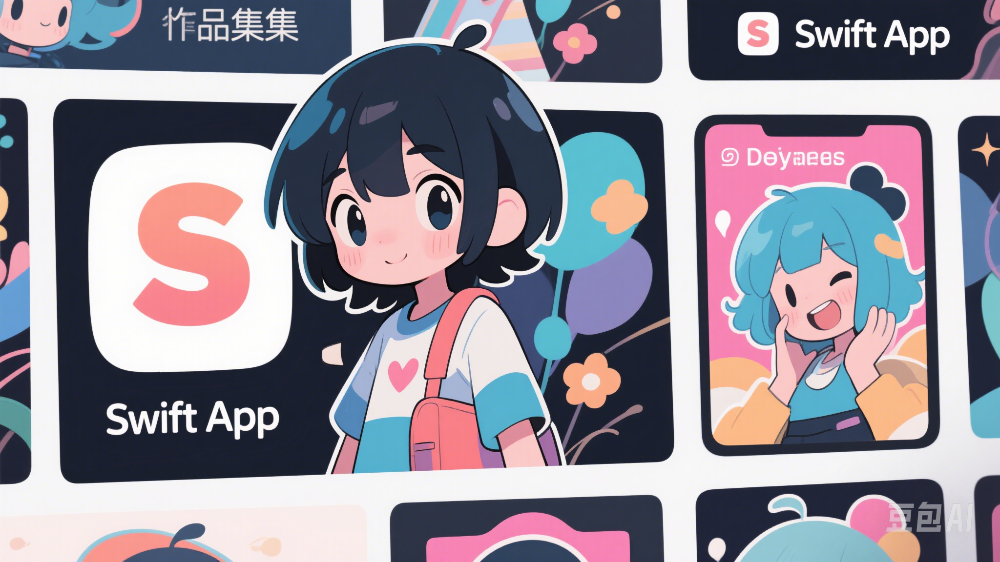
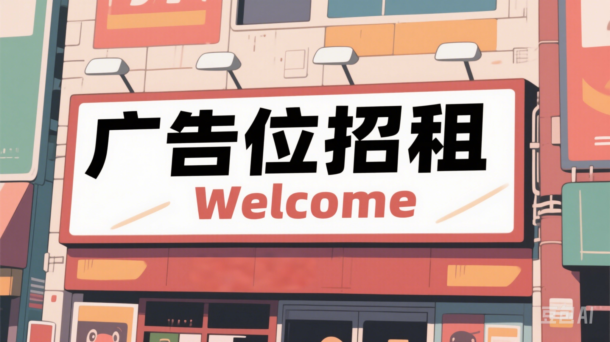

# 🎨 SwiftPortfolio | 我的 Swift App 作品集

> A curated bilingual space for personal Swift creations  
> 这是一个展示我 Swift 学习旅程的中英文作品集，目前为架构阶段。

---

---

## 🧭 关于本仓库 | About

本仓库用于集中管理我未来开发的 Swift 项目。  
我将把每一个 Swift App 作为一个独立模块加入其中，并统一管理。  
This repository is a future-facing container for my Swift creations.

---

## 🗂 项目结构规划 | Project Structure

---

## 📬 联系我 | Contact

有兴趣交流？合作？反馈建议？我在这里等你。

- 📧 Email: nozickaturben465@gmail.com  
- 🐙 GitHub Issues: https://github.com/Renace007/SwiftPortfolio/issues

Feel free to reach out if you want to collaborate, discuss ideas, or report issues.  
Let's build something meaningful together.

---

> 留白，是一种构建的节奏。  
> The blank space is just the beginning of composition.
